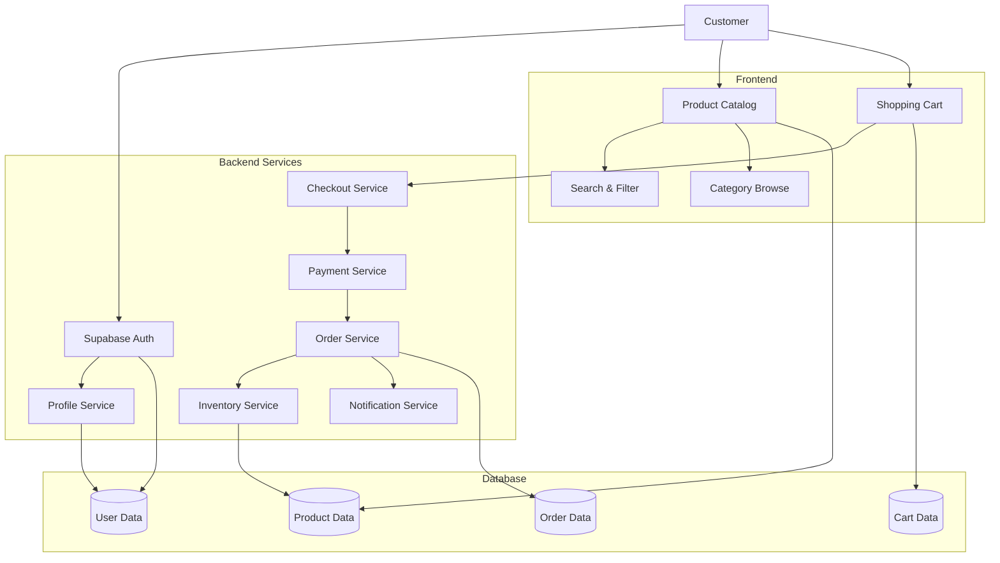
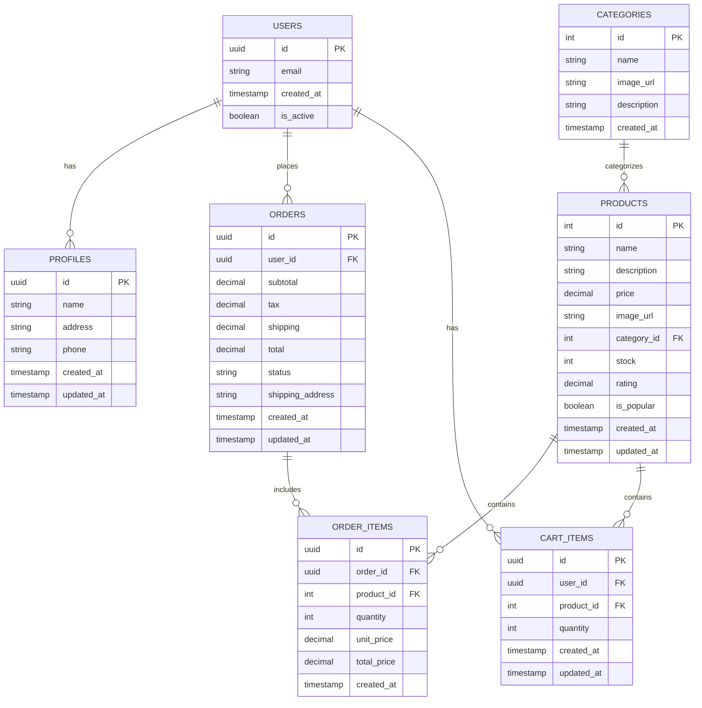

# Fresh Cart - System Diagrams

## Data Flow Diagram

## Entity Relationship Diagram

### Database Schema Details

#### Users Table
- Primary authentication table
- Managed by Supabase Auth
- Contains core user data
- Links to extended profile information

#### Profiles Table
- Extended user information
- Shipping addresses
- Contact details
- Preferences

#### Products Table
- Product information
- Inventory tracking
- Pricing
- Ratings and reviews
- Category association

#### Categories Table
- Product categorization
- Navigation structure
- Category metadata

#### Orders Table
- Order tracking
- Payment information
- Shipping details
- Status management

#### Order Items Table
- Individual order items
- Quantity tracking
- Price snapshots
- Product references

#### Cart Items Table
- Shopping cart state
- Temporary storage
- User selections
- Product references

### Key Relationships

1. **User → Profile** (1:1)
   - Each user has one profile
   - Profile contains extended user information

2. **User → Orders** (1:N)
   - Users can have multiple orders
   - Orders are linked to a single user

3. **Order → Order Items** (1:N)
   - Each order contains multiple items
   - Items are linked to specific products

4. **Category → Products** (1:N)
   - Categories contain multiple products
   - Products belong to one category

5. **User → Cart Items** (1:N)
   - Users can have multiple cart items
   - Cart items are linked to products
