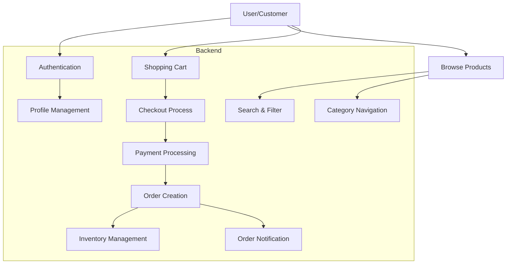
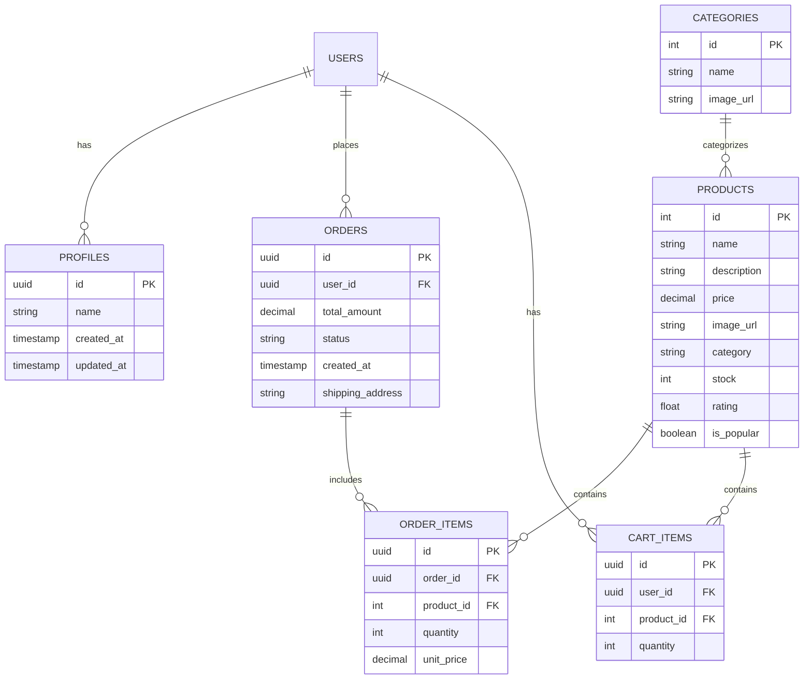

# Fresh Cart E-commerce Platform

## Overview Slides

### Slide 1: Introduction
- **Fresh Cart**: Modern E-commerce Platform
- Built with React, TypeScript, and Tailwind CSS
- Focus on Indian Groceries and Household Items
- Real-time Inventory Management

### Slide 2: Key Features
- User Authentication & Profile Management
- Product Catalog with Categories
- Shopping Cart & Wishlist
- Order Management
- Real-time Stock Updates
- Secure Payment Processing

### Slide 3: Technology Stack
- Frontend: React 18, TypeScript, Tailwind CSS
- Backend: Supabase
- Authentication: Supabase Auth
- Database: PostgreSQL (via Supabase)
- State Management: React Context
- Icons: Lucide React

### Slide 4: Architecture
- Component-Based Structure
- Context-Based State Management
- RESTful API Integration
- Responsive Design
- Progressive Web App Ready

### Slide 5: Security Features
- JWT-based Authentication
- Row Level Security (RLS)
- Secure Payment Processing
- Data Encryption
- Input Validation

### Slide 6: Future Roadmap
- Mobile App Development
- Advanced Search with Filters
- Loyalty Program
- Real-time Order Tracking
- Social Features & Reviews

## Data Flow Diagram

## Entity Relationship Diagram

### Database Schema Details

1. **Users Table**
   - Managed by Supabase Auth
   - Contains authentication data
   - Links to user profiles

2. **Profiles Table**
   - Extended user information
   - One-to-one relationship with Users
   - Stores user preferences

3. **Products Table**
   - Core product information
   - Inventory management
   - Rating and popularity tracking

4. **Categories Table**
   - Product categorization
   - Navigation structure
   - Category images

5. **Orders Table**
   - Order tracking
   - Payment status
   - Shipping information

6. **Order Items Table**
   - Order details
   - Product quantities
   - Price snapshots

7. **Cart Items Table**
   - Shopping cart state
   - User selections
   - Temporary storage